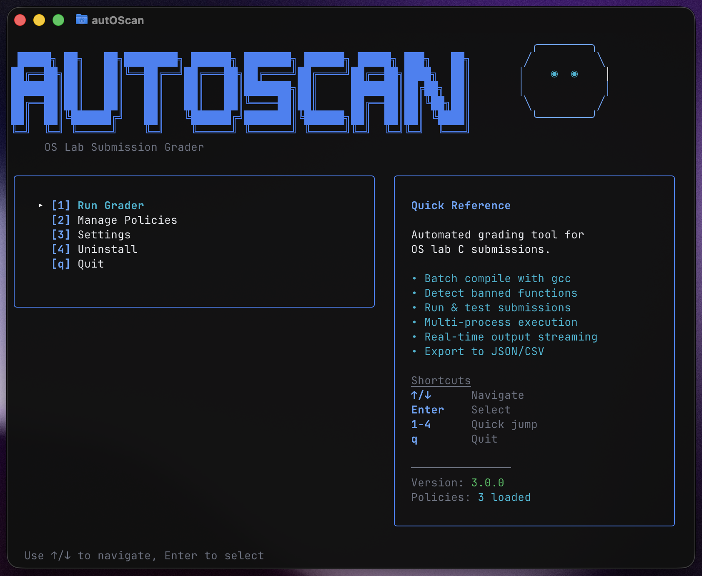

<h1 align="center">autOScan</h1>

<p align="center">
  <strong>TUI tool for grading C lab submissions</strong>
</p>

<p align="center">
  <a href="#"></a>
  <a href="#"></a>
  <a href="#"></a>
  <a href="#"></a>
</p>

<p align="center">
  
</p>

---

## Features

- Batch compile and grade C submissions
- Detect banned function calls (e.g., `printf`, `fprintf`)
- **Run and test compiled submissions** with custom arguments or preset test cases
- **Multi-process execution** with real-time streaming output
- **Scrollable output** for viewing long execution results
- **Output comparison for test cases** with highlighted diffs
- **Similarity detection across submissions** with per-file metrics
- **Side-by-side pair detail view** with highlighted matches and pane scrolling
- Create and manage grading policies (single-process and multi-process modes)
- Filter results by status (pass/fail/banned)
- Export results to JSON or CSV
- Interactive folder browser for selecting submission directories

---

## Installation

**Supported Platforms:** macOS (arm64), Linux (amd64) and Windows (amd64)

Download the appropriate binary from [Releases](https://github.com/felitrejos/autOScan/releases):

**macOS:**
```bash
chmod +x autoscan-darwin-arm64
./autoscan-darwin-arm64
```

**Linux:**
```bash
chmod +x autoscan-linux-amd64
./autoscan-linux-amd64
```

**Windows:**
```bash
NOT TESTED YET
```

On first run, it auto-installs to `~/.local/bin/autoscan` and prompts you to add to PATH if needed.

### Build from Source

```bash
git clone https://github.com/felitrejos/autOScan.git
cd autOScan
make install
```

**Requires:** Go 1.22+, gcc

---

## Usage

```bash
autoscan
```

### Navigation

- **↑/↓** - Navigate lists
- **Enter** - Select/confirm
- **Esc** - Go back
- **Tab** - Switch tabs (in detail view)

### Main Menu

1. **Run Grader** - Select a policy and grade submissions
2. **Manage Policies** - Create, edit, or delete grading policies
3. **Settings** - Configure global settings
4. **Uninstall** - Remove autoscan and configs

### Grading Results

- **[OK]** - Compiled successfully, no banned calls
- **[!]** - Has banned function calls
- **[X]** - Compilation failed
- **CHECK** - Requires manual testing
- **2** - Automatic fail grade (compile error or banned calls)

### Similarity View

After a run, switch to the **Similarity** tab to see ranked pairs per source file.
Keys: **↑/↓** navigate, **h/l** switch source file/process, **Enter** opens pair detail, **Esc** goes back.

**Pair detail view:** side-by-side code panes with highlighted spans.
Keys: **↑/↓** scroll, **←/→** pan, **h/l** switch pane.

---

## Configuration

On first run, configs are created at `~/.config/autoscan/`:

```
~/.config/autoscan/
├── policies/        # Policy YAML files
├── libraries/       # Bundled library files (.c/.h/.o)
├── test_files/      # Bundled test input files
├── expected_outputs/ # Bundled expected output files
├── banned.yaml      # Global banned functions
└── settings.yaml    # User preferences
```

### Policy Example (Single-Process)

```yaml
name: "Lab 03 - Processes"
compile:
  gcc: "gcc"
  flags: ["-Wall", "-Wextra", "-lpthread"]
  source_file: "lab03.c"  # Binary name derived automatically (lab03)
run:
  test_cases:
    - name: "Basic test"
      args: ["2", "3"]
      expected_exit: 0
library_files:
  - hospital.h    # Header file
  - hospital.o    # Pre-compiled object
test_files:
  - input.txt     # Test input file
```

### Library Files

Library files are additional files that get compiled/linked with each student submission. Supported types:

| Extension | Purpose | How it's used |
|-----------|---------|---------------|
| `.c` | Source files | Compiled with student code |
| `.h` | Header files | Found via `-I` flag for `#include` |
| `.o` | Object files | Linked directly with student code |

When you add a library file, it is **copied** to `~/.config/autoscan/libraries/` so it stays bundled with autoscan. You can run autoscan from anywhere and the library files will be available.

**Example with pre-compiled library:**
```yaml
library_files:
  - hospital.h   # Header for #include "hospital.h"
  - hospital.o   # Pre-compiled object to link
```

Add library files via the policy editor:
- `[a]` - Add new file from filesystem
- `[e]` - Use existing bundled file
- `[d]` - Remove from policy

### Banned Functions

Edit via the TUI (Manage Policies → Edit Banned Functions) or directly in `~/.config/autoscan/banned.yaml`:

```yaml
banned:
  - printf
  - fprintf
  - puts
```

### Settings

- **Short Names** - Truncate folder names at first underscore
- **Keep Binaries** - Preserve compiled binaries after grading (required for Run feature)
- **Max Workers** - Limit concurrent compilation processes (0 = use all CPUs)
- **Plagiarism Window Size** - Window size for similarity detection
- **Plagiarism Min Func Tokens** - Minimum tokens per function to compare
- **Plagiarism Score Threshold** - Similarity threshold for reporting

---

## Running Submissions

The **Run** tab in the detail view lets you execute compiled submissions:

### Requirements

1. Enable **Keep Binaries** in Settings
2. Submission must compile successfully

### Custom Execution

- Enter command-line arguments in the "Arguments" field
- Enter stdin input in the "Stdin" field (use `\n` for newlines)
- Press Enter on "Run" to execute

**Output Navigation:**
- Use **↑/↓** to navigate to the output box
- Press **Enter** to focus for scrolling
- Use **↑/↓** to scroll through long output
- Press **Esc** to exit scroll mode

### Preset Test Cases

Define test cases in your policy for automated testing:

```yaml
name: "Lab 05 - Arguments"
compile:
  gcc: "gcc"
  flags: ["-Wall"]
  source_file: "lab05.c"  # Binary name derived automatically (lab05)
run:
  test_cases:
    - name: "No arguments"
      args: []
      expected_exit: 1
    - name: "Valid input"
      args: ["hello", "world"]
      input: "test\n"
      expected_exit: 0
    - name: "Stress test"
      args: ["--count", "1000"]
      expected_exit: 0
```

**Test case fields:**
- `name` - Human-readable test name
- `args` - Array of command-line arguments
- `input` - Stdin input to provide (use `\n` for newlines)
- `expected_exit` - Expected exit code (for pass/fail validation)
- `expected_output_file` - Optional stdout comparison file (diff shown in results)

Select a test case and press Enter to run it.

### Multi-Process Mode

For labs requiring multiple programs to run simultaneously (like message queues, semaphores, or producer/consumer patterns), configure multi-process mode:

```yaml
name: "Lab 07 - Message Queues"
compile:
  gcc: "gcc"
  flags: ["-Wall"]
run:
  multi_process:
    enabled: true
    executables:
      - name: "Producer"
        source_file: "producer.c"
        args: ["queue1", "5"]
      - name: "Consumer"
        source_file: "consumer.c"
        args: ["queue1"]
        start_delay_ms: 100  # Start 100ms after producer
      - name: "Monitor"
        source_file: "monitor.c"
        args: ["--verbose"]
```

**Multi-process fields:**
- `name` - Display name for the process
- `source_file` - The .c file (binary is named without .c extension)
- `args` - Default command-line arguments
- `input` - Stdin input
- `start_delay_ms` - Delay before starting (for staggered startup)

Each multi-process executable must define `source_file`.

### Multi-Process Test Scenarios

Define multiple test configurations for the entire multi-process setup:

```yaml
run:
  multi_process:
    enabled: true
    executables:
      - name: "Producer"
        source_file: "producer.c"
      - name: "Consumer"
        source_file: "consumer.c"
    test_scenarios:
      - name: "No arguments (should fail)"
        process_args:
          Producer: []
          Consumer: []
        process_inputs:
          Producer: ""
          Consumer: ""
        expected_exits:
          Producer: 1
          Consumer: 1
      - name: "Valid files"
        process_args:
          Producer: ["input.txt", "pipe1"]
          Consumer: ["pipe1", "output.txt"]
        expected_exits:
          Producer: 0
          Consumer: 0
      - name: "Missing input file"
        process_args:
          Producer: ["nonexistent.txt", "pipe1"]
          Consumer: ["pipe1", "output.txt"]
        expected_exits:
          Producer: 1
          Consumer: 0
```

**Running Multi-Process:**
- Select "Run" and press Enter to run with default args
- Select a test scenario and press Enter to run it
- Output streams in real-time to each process box

**Scenario output comparison:**
- `expected_outputs` maps process name → expected output filename
- Diff is shown when an expected output file is provided

### Bundled Test Files

If tests require input files (`.txt`, `.bin`, etc.), bundle them with the policy:

```yaml
test_files:
  - input.txt
  - sample_data.bin
  - expected_output.txt
```

**How it works:**
1. Files are copied to `~/.config/autoscan/test_files/`
2. When you use a bundled filename in test args, it auto-resolves to the full path
3. Example: `args: ["input.txt"]` becomes `args: ["/home/user/.config/autoscan/test_files/input.txt"]`

Add test files via the policy editor (similar to library files):
- `[a]` - Add new file from filesystem
- `[e]` - Use existing bundled file
- `[d]` - Remove from policy

### Bundled Expected Outputs

Expected output files are stored in `~/.config/autoscan/expected_outputs/` and referenced by `expected_output_file`
or `expected_outputs` in multi-process scenarios. Add them via the policy editor or place files directly in that folder.

All processes run in parallel with **real-time streaming output**. Results are shown in a responsive grid layout with pass/fail indicators.

**Output Navigation:**
- Use **↑/↓** to select a process box
- Press **Enter** to focus for scrolling
- Use **↑/↓** to scroll through output
- Press **Esc** to exit scroll mode

**Configuring via TUI:**
1. Go to Manage Policies → Edit your policy
2. Set Execution Mode to "Multi-Process"
3. Press `[a]` to add a process
4. Fill in: Name, Source File, Arguments, Start Delay
5. Processes are auto-compiled from their source files

**Deadlock Handling:**

If processes get stuck in a deadlock:
- **Manual kill**: Press `Ctrl+K` while running to send SIGKILL to all processes
- Watch real-time output to know when to kill

---

## Export

Export grading results to:

- **JSON** - Structured data for further processing
- **CSV** - Spreadsheet compatible format

Files are saved to the current working directory.

---

## License

MIT
